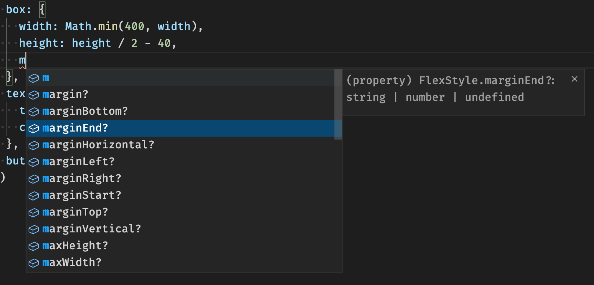

# react-native-swag-styles

Dynamic Styles for React Native and Expo Web

[](https://circleci.com/gh/ef-eng/react-native-swag-styles/tree/main)
[](https://www.npmjs.com/package/react-native-swag-styles)
[](https://github.com/ef-eng/react-native-swag-styles/blob/main/LICENSE)

## Highlights

- **Dynamic.** Based on React Hook. It automatically re-renders when necessary.
- **Unopinionated.** Use whatever component or theme library you want.
- **Simple to use.** No HOC, no special syntax. Easily migrate from plain StyleSheet.
- **Strictly typed.** Take full advantage of TypeScript. Get auto-completions in VSCode.



## Installation

```sh
yarn add react-native-swag-styles
```

## Usage

Replace `StyleSheet.create` with `makeStyles` with callback:

```diff
- import { StyleSheet } from 'react-native';
+ import { makeStyles } from 'react-native-swag-styles';

- const styles = StyleSheet.create({
+ const useStyles = makeStyles(() => ({
  underlayColor: '#333',
  container: {
    paddingTop: 24,
    paddingBottom: 32,
  },
-});
+}));
```

Use created style hook in component:

```tsx
const Foo = () => {
  const styles = useStyles();
  return (
    <View style={styles.container}>
      <TouchableHighlight underlayColor={styles.underlayColor} />
    </View>
  );
};
```

To make the style dynamic, pass props to the style creator:

```ts
const useStyles = makeStyles((small: boolean) => {
  const iconSize = small ? 16 : 24;
  return {
    icon: {
      width: iconSize,
      height: iconSize,
    },
    // ...
  };
});

const Foo = () => {
  const styles = useStyles(true);
  // ...
};
```

### Advanced Usage:

If you use a theming library, you can attach the theme hook when creating styles:

```ts
const useStyles = makeStyles(
  useAppTheme,
  // first argument is the return value of your theme hook
  ({ colors, insets }) => ({
    underlayColor: colors.grey,
    container: {
      paddingTop: insets.top,
      paddingBottom: insets.bottom,
    },
  })
);
```

You can also create styles using multiple hooks, as long as the hooks don’t take any argument:

```ts
const useStyles = makeStyles(
  useAppTheme,
  useWideScreen,
  useWindowDimensions,
  // The order of arguments matches the order of hooks above
  ({ colors, fonts }, isWideScreen, { width }) => {
    // ...
  }
);
```

Pass hooks and extra props together to the style creator:

```ts
const useStyles = makeStyles(
  useAppTheme,
  useWideScreen,
  ({ brandColor, colors, fonts }, isWideScreen, small: boolean) => {
    // ...
  }
);
```

**Important Note:** Hook returns and props must be plain (serializable) object/values for memoization to work properly. See [fast-memoize.js](https://github.com/caiogondim/fast-memoize.js#function-arguments).

### Other APIs

`createStyleSheet` extends `StyleSheet.create` to support constant values:

```ts
import { createStyleSheet } from 'react-native-swag-styles';

const styles = createStyleSheet({
  text: 'some kind of string',
  regularStyle: {
    paddingTop: 24,
    paddingBottom: 32,
  },
});
```

## Example

To see a full working example, with a custom theme, check out the `example` folder.

## Contributing

See the [contributing guide](CONTRIBUTING.md) to learn how to contribute to the repository and the development workflow.

## Acknowledgements

Thanks to the authors of these libraries for inspiration:

- [native-theme](https://github.com/CarlosBalladares/native-theme)
- [@material-ui/styles](https://material-ui.com/styles/basics/#hook-api)

## License

MIT
